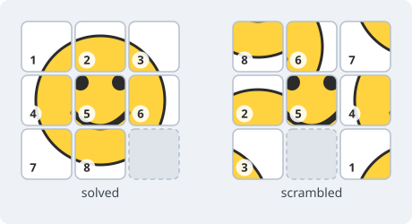

# Sliding-Tile Puzzle

Exact bounds and learned search for the 15- and 24-puzzle, in Rust.

A sliding-tile puzzle is a grid of numbered tiles with one square left empty. A
move slides a tile into the empty square. From a scrambled start, put the tiles
back in order — in as few moves as possible.



Easy to state, and easy to solve badly. Half of all tile arrangements cannot be
reached at all: every move flips a parity invariant, so the arrangements split
into two classes and only one of them contains the goal (Johnson & Story, 1879).
And while *some* solution can always be found quickly, finding a **shortest** one
is NP-hard in general (Ratner & Warmuth, 1990). Brute force runs out early —
181,440 reachable arrangements for the 8-puzzle, but 1.05 × 10¹³ for the
15-puzzle and 7.76 × 10²⁴ for the 24-puzzle.

The puzzle is popularly credited to Sam Loyd, wrongly. It was devised by Noyes
Palmer Chapman, a postmaster in Canastota, New York, who is said to have shown a
version to friends around 1874, and it became an international craze in 1880 —
the year Chapman's patent application was rejected as too close to prior art.
Loyd first wrote about it in 1886, seven years into the craze, and only claimed
to have invented it in 1891, a claim he repeated until his death in 1911. He
also offered $1,000 to anyone who could solve the puzzle from a position with
tiles 14 and 15 swapped: safe money, since Johnson and Story had proved that
position unreachable a decade earlier. Slocum and Sonneveld (2006) reconstructed
the record from newspaper archives.

How many moves the *hardest* position needs, as a function of board size, is
[OEIS A087725](https://oeis.org/A087725) — the sequence this repository is named
after:

| board | reachable arrangements | hardest position needs |
|---|---:|---|
| 2×2 — 3-puzzle | 12 | 6 moves |
| 3×3 — 8-puzzle | 181,440 | 31 moves |
| 4×4 — 15-puzzle | 1.05 × 10¹³ | 80 moves |
| 5×5 — 24-puzzle | 7.76 × 10²⁴ | **156 to 205 — open** |

The first three are settled: 31 (Reinefeld, 1993) and 80, first proved by
Brüngger et al. (1999) and independently confirmed by Korf and Schultze (2005),
whose exhaustive breadth-first search also produced the full depth distribution
and the 17 positions that attain 80. The 24-puzzle is not settled, and the gap
is wide: the ceiling of 205 is a community result (Whitmore, 2018), while the
floor is **156**, raised from 152 by the proof in §1 — the canonical hard
position needs exactly 156 moves, so the diameter is at least that. Random
24-puzzle positions average about 102 moves (Korf & Taylor, 1996), so the hard
ones have to be constructed rather than sampled — which is most of what this
repository does.

Three things live here: an exact 24-puzzle lower-bound prover, an exact
15-puzzle solver with a complete enumeration of its deepest boards, and a
learned system that constructs and solves hard 24-puzzle instances. All depths
are **single-tile moves (STM)**. Further reading:
[Wikipedia's 15 puzzle](https://en.wikipedia.org/wiki/15_puzzle) for the history
and the solvability proof; [OEIS A087725](https://oeis.org/A087725) for the
current bounds and onward links to their sources.

```sh
cargo build --release --features sha
cargo test
```

---

## 1. A 24-puzzle solver specialized for deep boards

### Optimizations

This project contributes three variations on the Walking Distance heuristic
(Takahashi, 2001), all admissible, all used by the prover:

- **cWD** — escape-constrained Walking Distance. WD sharpened by the moves a
  blank must spend leaving a line it is obliged to cross.
- **Last-moves Walking Distance** (`--lm`, `--lm2`) — WD refined by the forced
  final move or two of any solution. The last-moves idea is not itself novel
  (Korf & Taylor, 1996); pricing it against a WD abstraction is.
- **cLM2** (`--clm2`) — the two combined, with the last-two-move branches lifted
  by single-demanded-line escape constraints and priced *jointly*, which is
  stronger than taking the maximum of the two separately.

[`WD.md`](docs/WD.md) derives all three from scratch with worked examples.

This project also adopts the following optimizations. If a citation below is
missing, please open a GitHub issue and it will be added.

- **Iterative, not recursive.** Search state lives in a depth-indexed arena
  allocated once; there is no call frame to spill across.
- **No allocation on the per-node path.** The arena and every front cache are
  built once per worker and reused across work units and thresholds.
- **One axis copied per move, the other shared** with an ancestor for the cost
  of a one-byte index.
- **Move-pruning DFA.** Taylor–Korf duplicate elimination
  (Taylor & Korf, 1993), compiled to a 41,396-state automaton (687 KiB) and
  folded into the candidate mask.
- **Child pre-prune from the parent's neighbour-WD** — over-bound children are
  skipped before being built, with no table probe.
- **σ-orbit split at the root** (Culberson & Schaeffer, 1994), halving the tree
  on a σ-symmetric board.
- **Additive (Korf & Felner, 2002) 8-tile zero-aware PDBs**
  (Clausecker & Reinefeld, 2019), each queried in both σ-views.
- **1 bit per PDB entry** (Clausecker & Reinefeld, 2019), not 8 — distances
  reconstructed differentially.
- **Lazy cascade**: each tier is consulted only at nodes the cheaper ones failed
  to prune.

### What it proves

The target is `R`, the canonical hard instance — the goal rotated 180°, which
the literature calls the "turned 180-degree" configuration. The literature
records `optimal(R) ∈ [152, 156]` (Hannanov & Rokicki, 2011); this project
closes that interval from below.

```text
      goal                    R

    1  2  3  4  5         · 24 23 22 21
    6  7  8  9 10        20 19 18 17 16
   11 12 13 14 15        15 14 13 12 11
   16 17 18 19 20        10  9  8  7  6
   21 22 23 24  ·         5  4  3  2  1
```

**Status — done.** Every threshold from 144 through 154 is exhausted,
**609,193,630,407,023 nodes** in total, which proves `optimal(R) ≥ 156`. The
upper bound of 156 is published and replay-verified (`docs/FINDINGS_R.md` §1), so
the two meet:

> **optimal(R) = 156.**

| threshold | nodes | × previous |
|---|---:|---:|
| 144 | 115,436,814 | — |
| 146 | 4,363,759,350 | 37.8 |
| 148 | 114,245,221,757 | 26.2 |
| 150 | 2,287,004,968,051 | 20.0 |
| 152 | 38,348,405,978,400 | 16.8 |
| 154 | 568,439,495,042,651 | 14.8 |

IDA\* re-searches the whole tree at every threshold, so the total is dominated
by its last rung: threshold 154 alone is 93% of it. The growth factor per rung
falls steadily, 37.8 down to 14.8, and that decay is what made the proof
finishable — had it stayed at 37.8, threshold 154 would have been about
8.9 × 10¹⁵ nodes, some 16× what it actually cost. Why it decays is not measured
here; the ratios are simply what the run recorded.

**The evidence, and how to check it.** `runs/ckpt156/` is committed. `main.ckpt`
holds the per-threshold totals above; `w0..w63.ckpt` hold one record per root
subtree — all **262,144** of them at threshold 154 — each with the node count
that subtree contributed. A verifier who doubts the total does not have to redo
609 trillion nodes to probe it: copy the checkpoint somewhere scratch, drop one
unit's record, and resume with the same `--config`. Finished units restore and
only the missing one is searched again, so its recomputed count can be held
against the record. The six-line `main.ckpt` is the proof's summary; the 262,144
unit lines are its audit trail.

Three independent guards stand behind the count. The engine's tree is frozen
against 180 oracle cases carried over from a deleted reference implementation,
so an optimization that changed a pruning decision would fail rather than
silently shrink the search (`src/puzzle24/search/oracle.rs`). The heuristic
tables are pinned by SHA-256 and were re-verified on the proof machine after the
run finished — ten of ten (`runs/r156_artifacts/table_sha256_verify.txt`). And
admissibility, the one property whose failure would invalidate the bound
outright, is machine-checked in Lean 4 ([`proofs/puzzle15-wd/`](proofs/puzzle15-wd/)):
Manhattan and Walking Distance are proved admissible outright, and cWD's escape
machinery and forced-escape bound are sorry-free. Those proofs are stated for
the 15-puzzle, but the argument never uses the board size, so it carries to the
24-puzzle unchanged.

**What it cost.** Six weeks of wall clock, 2026-08-10 to 2026-09-20, on a single
Azure spot VM in New Zealand North — 64 cores for most of the run, 16 after a
mid-proof eviction could not be replaced at the same size. Spot capacity is
reclaimed without warning, so the search was restarted **74 times**, each time
resuming from the checkpoint; `runs/r156_artifacts/logs/evictions.log` is the
record. The node counts above are cumulative across all of those runs, which is
also why no single wall-clock rate describes the proof.

### Running it

```sh
cargo build --release --features sha

# Tables: ~49 GB, several hours. Timings, SHA-256 pins and machine
# requirements are in RUNBOOK_R156.md.
target/release/build_wd24 --out data/wd24.bin --verify-sha data/wd24.bin.sha256
target/release/build_cwd_table          # -> data/cwd_single.bin
target/release/build_cwd_artifacts all  # -> cwd_mm, cwd_lm, cwd_lm2, cwd_lm_mm, cwd_lm1l_mm

target/release/build_pdb24 --zero-aware --tiles 1,2,3,4,6,7,8,9 \
    --out data/pdb24_k8_a.zbin --verify-sha data/pdb24_k8_a.sha256
target/release/build_pdb24 --zero-aware --tiles 5,10,14,15,19,20,23,24 \
    --out data/pdb24_k8_b.zbin --verify-sha data/pdb24_k8_b.sha256
target/release/build_pdb24 --zero-aware --tiles 11,12,13,16,17,18,21,22 \
    --out data/pdb24_k8_c.zbin --verify-sha data/pdb24_k8_c.sha256

# Prove a lower bound on R with the full cascade, in parallel.
# --prove-at-least 145 exhausts threshold 144 and should report exactly
# 115,436,814 nodes. --prove-at-least 156 is the full proof: it caps the
# ladder at 155, which by parity means exhausting through 154.
R="0 24 23 22 21 20 19 18 17 16 15 14 13 12 11 10 9 8 7 6 5 4 3 2 1"
target/release/solve24 --config standard --position "$R" \
    --prove-at-least 145 --clm2 --zpdb8 --parallel
```

Threshold 144 takes seconds and is the canary; the full proof took six weeks on
64 cores and needs `--checkpoint` to survive restarts. `RUNBOOK_R156.md` has the
procedure, and `runs/ckpt156/` is the completed record — never point
`--checkpoint` at it, since the solver appends.

---

## 2. Measuring heuristic quality (η)

Clausecker and Schintke (2021) define the constant that says what an admissible
heuristic is worth. For a heuristic `h` on a state space `V` with asymptotic
branching factor `b`, the **heuristic quality**

```text
eta = |V|^-1 * sum over v of w(v) * b^-h(v)
```

is the factor by which IDA\* with `h` multiplies the node count of uninformed
iterative deepening on hard instances. Smaller is better, and the ratio of two
heuristics' η is how many times fewer nodes one expands than the other. The
thesis behind the paper (Clausecker, 2020) works the 24-puzzle example out in
full, including the sphere-stratified sampling that makes η computable at all:
η is dominated by rare states close to the goal, so a uniform sample of the
7.76 × 10²⁴ states never sees the terms that matter.

This repository reproduces that measurement for Manhattan distance and then
applies it to its own heuristics, so the WD variations above can be compared on
the scale the literature uses.

### Replicating Manhattan distance

Manhattan distance is a sum of per-tile terms, so `sum b^-MD` over all tile
placements is a 25×25 permanent, and the solvable half is `(perm + det)/2`. That
gives η exactly, with no sampling:

| weighting | exact η (MD) | published (Clausecker, 2020, Table 5.1) |
|---|---|---|
| uniform | 1.0010 × 10⁻¹⁹ | 9.926 × 10⁻²⁰ ± 9.08% |
| tree equilibrium | 9.7305 × 10⁻²⁰ | (same interval) |
| degree | 9.7565 × 10⁻²⁰ | (same interval) |

All three sit inside the published interval, and `eta_perfect` and the sphere
histogram of Fig. 5.2 reproduce exactly from the sphere sizes.

### A second stratification: Manhattan levels

States 65 or more moves from the goal are sampled uniformly and form their own
stratum. For Manhattan distance that stratum holds about a sixth of η, carried
by boards whose Manhattan distance is far below their distance from the goal —
the region Clausecker (2020) §5.1 identifies as the one the spheres do not
reach, and spends 10⁹ draws rather than 10⁸ on for this heuristic. In our own
7.1 × 10⁸-draw run, a single board with Manhattan distance 31 carried 21% of
that stratum's estimate, which is the variance such a region produces.

This repository adds a second stratification for it. The placements at each
Manhattan distance can be counted exactly (a subset DP over the 2²⁵ cell
subsets), so each level can be sampled directly and weighted by its exact size,
with no reliance on rare draws. Run against the exact total it agrees to 0.013%,
and it measures the stratum to ±2.1%. It also calibrates our own sphere
sampling: summed over k = 0..64 those samples come in 11% below the level
estimate, from the heavy-tailed reach weights at depth.

### Results

Uniform weighting, 95% intervals; `b = 2.367604543724`.

| heuristic | η | × fewer nodes than MD | η at distance ≥ 65 |
|---|---|---:|---:|
| Manhattan | 1.0010 × 10⁻¹⁹ (exact) | 1 | 15.8% |
| WD | 1.8581 × 10⁻²⁰ ± 0.09% | 5.4 | 12.9% |
| cWD | 2.7110 × 10⁻²¹ ± 0.10% | 36.9 | 7.6% |
| LM2 (`--lm2`) | 2.3430 × 10⁻²¹ ± 0.10% | 42.7 | 7.4% |
| cLM2 (`--clm2`) | 1.6406 × 10⁻²¹ ± 0.12% | 61.0 | 6.4% |
| k8 (`--zpdb8`) | 2.9194 × 10⁻²³ ± 2.0% | 3,429 | 1.6% |
| cascade `--clm2 --zpdb8` | 2.5886 × 10⁻²³ ± 2.0% | 3,867 | 1.7% |

So cWD is worth 6.9× over plain WD, cLM2 a further 1.65× over cWD, and the k8
tier dominates everything by two orders of magnitude — while cLM2 still earns
its place in the cascade, at 1.13× over k8 alone, concentrated near the goal.

Two properties worth recording. The tier values come from the engine's own
consult code, not a reimplementation, and are checked against true distances.
And LM2 alone is **not consistent**: about 1 neighbour pair in 1,700 differs by
3 rather than at most 1, so its η is an approximation of the node-count factor;
cWD, cLM2, k8 and the cascade showed no violation in 2 × 10⁶ boards.

### Running it

```sh
# Exact spheres k <= 24, then sphere samples for k = 25..64.
target/release/eta24 campaign layers --dir data/eta24 --heuristic md
target/release/eta24 campaign sample --dir data/eta24 --thread-seconds 600

# The far half: uniform draws, then the Manhattan-level strata.
target/release/eta24 campaign tail    --dir data/eta24 --thread-seconds 3600
target/release/eta24 campaign tail-md --dir data/eta24 --thread-seconds 3600

# Total eta with no distance proofs at all, and the combined score.
target/release/eta24 campaign total --heuristic clm2
target/release/eta24 campaign score --dir data/eta24 --heuristic clm2
```

Full method, per-sphere tables and the run logs are in
[`records/eta24_md.txt`](records/eta24_md.txt) (Manhattan, including the
replication against both papers), [`eta24_wd.txt`](records/eta24_wd.txt),
[`eta24_tiers.txt`](records/eta24_tiers.txt) (cWD, LM2, cLM2) and
[`eta24_k8.txt`](records/eta24_k8.txt) (k8 and the cascade).

---

## 3. A 15-puzzle solver, and every board at depths 76–80

`solve15` solves any 15-puzzle position **optimally** via IDA\* with additive
pattern databases. The default heuristic is `korf`; the strongest is
`korf-plus`:
`max(Korf 7-8 PDB, its reflection, linear conflict, walking distance)`. Even a
depth-80 antipode solves in seconds.

```sh
target/release/solve15 --pdb-dir data/ --position "<16 tokens>"
```

### The enumeration

Built on top of that: the **complete** set of boards at each depth 76–80 —
every board whose optimal solution length is exactly `D`, not a sample.

| depth | boards | = N(d)? |
|---|---:|---|
| 80 | 17 | ✓ |
| 79 | 70 | ✓ |
| 78 | 3,406 | ✓ |
| 77 | 26,638 | ✓ |
| 76 | 272,198 | ✓ |
| **total** | **302,329** | |

Each layer is checked against `N(d)` from the Korf–Schultze distribution
(`data/pdb15_depth_histogram.txt`), which serves as both the termination oracle
and a per-layer correctness gate. All five match exactly. Output is
`data/enum15/depthNN.ranks`, full symmetry orbits.

The format is headerless: the file is consecutive 6-byte little-endian unsigned
integers, sorted ascending, so the board count is (file size) / 6. Each value
indexes a *solvable* state in `[0, 16!/2)`. Six bytes because 16!/2 ≈ 1.05 ×
10¹³ fits in 48 bits.

`enum_expand15` decodes a file, and re-verifies it on the way through:

```text
$ enum_expand15 --file data/enum15/depth80.ranks --limit 3 --print
data/enum15/depth80.ranks: 17 boards
round-trip + solvability: OK (17 ranks)
_ 11 9 13 12 15 10 14 3 7 6 2 4 8 5 1
_ 12 9 13 15 8 10 14 11 7 6 2 4 3 5 1
_ 12 9 13 15 11 10 14 3 7 2 5 4 8 6 1
```

Row-major, `_` for the blank. Those are three of the 17 depth-80 antipodes —
the canonical published set, not a product of this repository. Adding
`--verify --depth 80 --pdb-dir data` re-solves a sample with the zero-aware
`zpdb-plus` heuristic, which pointwise dominates `korf-plus`, and asserts every
optimal length is exactly 80.

The method avoids searching the 10.46-trillion-state space by never leaving the
top layers, and is mostly **solve-free**. Two structural facts do the work:
neighbouring boards differ in optimal depth by exactly ±1 (parity), and
`depth(s) = 1 + min over neighbours`. So expanding a certified layer `d+1`
identifies its depth-`d` neighbours with no search at all, and boards missed
that way — strict local maxima — are recovered by a Bellman membership test over
2–4 neighbours. IDA\* is a fallback for the residue only, never the descent.

[`ENUMERATION.md`](docs/ENUMERATION.md) has the algorithm in full. Note its status
section predates the current data, which reaches depth 76.

---

## 4. Learned search for deep 24-puzzle boards

The 24-puzzle has no ground truth past depth ~30, so a learned system can't be
graded against optima. This part is built around that: a solver and a generator
that improve each other, with every claim bracketed by independent evidence.

**Solver.** A cost-to-go value network `V(s)` — raw one-hot board in, no
admissible heuristic anywhere in its input or training. Trained by DAVI
(approximate value iteration, DeepCubeA-style) and deployed through Batch
Weighted A\* Search, `f(x) = g(x) + weight·V(x)`. Non-admissible, so its answers
are upper bounds and every one is replay-verified from scratch.

**Generator.** A policy network that builds a board by choosing moves from
`GOAL`, trained by REINFORCE — its reward depends on running the solver's actual
search, which is not differentiable. The reward is GANCO-style regret: the
learned solver's cost minus a fixed admissible baseline's, which targets boards
where the learned solver underperforms rather than boards that are merely hard.

Implementation is `src/puzzle24/ml/` on `candle` (Metal backend, CPU fallback);
[`TRAINING.md`](docs/TRAINING.md) documents the design and the 15-puzzle proof of
concept that validated it, where exact ground truth exists.

### Results

**It solved `R` in 156 moves** — matching the best published solution — having
never seen `R` or any state on its solution path. The literature's 156 was
hand-constructed from R's rotational symmetry; this one was discovered by
generic learned search. Replay-verified in `data/r156_ours_solution.txt`.
See [`FINDINGS_R.md`](docs/FINDINGS_R.md).

**A catalog of certified-deep boards.** A construct → score → bound → re-seed
loop produced **542 instances**, each bracketed by a proven lower bound
(bounded IDA\* exhaust) and a replay-verified learned upper bound: 504 with
LB ≥ 132, 204 at ≥ 138, 106 at ≥ 140, 19 at ≥ 142. Across 2,713 evidence rows,
**zero LB > UB inversions** — the two independent solvers never contradicted
each other. The registry is `data/catalog24.tsv`; see [`FINDINGS_HUNT.md`](docs/FINDINGS_HUNT.md).

The bracket is what makes an entry scientific rather than suggestive: a board at
`[138, 160]` is a certified-deep instance whose optimum is pinned to a 22-wide
window. "WD says 128" is not.

This is a lower-bound-*side* result. It populates and certifies deep boards; it
does not prove any board deeper than `R`, so the diameter floor it leaves is the
one §1 proves, 156.

---

## Layout

```
src/puzzle24/search/engine.rs     the lower-bound prover (§1)
src/puzzle24/search/recursive.rs  generic IDA*, optimal solving + deadlines
src/puzzle15/enumerate/           the depth 76-80 enumeration (§3)
src/puzzle24/ml/                  value net, policy net, DAVI, BWAS (§4)
src/puzzle8/                      the 8-puzzle warmup: full ground truth
proofs/puzzle15-wd/               Lean 4 admissibility proofs for WD and cWD
runs/ckpt156/                     the R = 156 proof record (§1)
runs/r156_artifacts/              the machine that produced it: logs, binary, pins
```

[`DESIGN.md`](docs/DESIGN.md) explains the 8-puzzle-first approach and the
compression question the project started from. [`WD.md`](docs/WD.md) documents the
walking-distance family the prover's heuristic is built on.
[`RUNBOOK_R156.md`](RUNBOOK_R156.md) is the proof procedure end to end: table
builds, SHA pins, node-identity canaries and machine requirements.
[`proofs/puzzle15-wd/README.md`](proofs/puzzle15-wd/README.md) lists which
admissibility results are machine-checked and with what axioms. `records/` holds
the measurement ledgers — grep `records/r_flat_k8_lazy.txt` before calling any
optimization idea untried; the measured graveyard there is larger than the
summaries suggest.

---

## References

Brüngger, A.; Marzetta, A.; Fukuda, K.; and Nievergelt, J. 1999. *The parallel
search bench ZRAM and its applications.* Annals of Operations Research
90:45–63. First proof that the 15-puzzle diameter is 80.

Clausecker, R., and Reinefeld, A. 2019. *Zero-Aware Pattern Databases with
1-Bit Compression for Sliding Tile Puzzles.* SOCS 2019, pp. 35–43. Improves on
the 1.6-bit mod-3 encoding of Breyer & Korf 2010. Construction details follow
Clausecker, *Notes on the Construction of Pattern Databases*, ZIB Report 17-59,
2017; see `docs/zpdb-codec-spec.md`.

Clausecker, R., and Schintke, F. 2021. *A Measure of Quality for IDA\*
Heuristics.* SOCS 2021, pp. 55–63. Defines heuristic quality η, the constant
factor a consistent heuristic takes off IDA\*'s node count, and the
sphere-stratified sampling that estimates it. The long version is Clausecker,
R. 2020, *The Quality of Heuristic Functions for IDA\**, ZIB Report 20-17, Zuse
Institute Berlin, whose §5 works the 24-puzzle through in full: Table 5.1's η
for the Manhattan heuristic and five ZPDB schemes, Fig. 5.3's per-sphere
histogram, and App. B's sampled sphere sizes for k = 31..64. §2 replicates the
Manhattan figures and measures this repository's own heuristics on the same
scale.

Culberson, J. C., and Schaeffer, J. 1994. *Efficiently Searching the
15-Puzzle.* Technical Report TR 94-08, Department of Computing Science,
University of Alberta. §2.1, "Mirror Positions", gives the argument in the form
used here: reflecting a path across the main diagonal is the move replacement
l↔u, r↔d, and Lemma 2.1 says a bound on a position applies to its mirror. A
closing footnote proposes normalising the board so mirror positions never enter
the search at all. Published as *Searching with Pattern Databases*, CSCSI 1996,
LNAI 1081, pp. 402–416, and *Pattern Databases*, Computational Intelligence
14(3), 1998, pp. 318–334, where it becomes Lemma 2 with the automorphism proof
spelled out and the claim that "the effective search space for sliding-tile
puzzles is half the size previously thought"; Korf & Schultze (2005) cite the
1998 version for the factor of two. All three state the node-level result, of
which the root split used here is the special case — none phrases it as
root-specific. Taking the maximum of a PDB and its reflection is a separate
technique from the same papers (§4.3 in the 1998 version).

Hannanov, B. ("stannic"), and Rokicki, T. 2011. *Twenty-Four puzzle, some
observations.* Domain of the Cube Forum, node 238,
`forum.cubeman.org/?q=node/view/238`, linked from OEIS A087725. The thread that
produced both published bounds on `R`: Hannanov opens it by proving ≥ 140 STM
"using good heuristic developed by Ken'ichiro Takahashi (takaken)", and Rokicki
then reports 12,225 distinct length-156 solutions (2011-08-09) and a completed
ply-150 search with no solution, giving ≥ 152 by parity (2011-08-18). H.
Kociemba also contributes. The forum 403s ordinary fetchers; use a browser
User-Agent.

Hannanov, B. ("stannic") 2017. *Pattern databases for the 5x5 sliding puzzle.*
Domain of the Cube Forum, node 555, `forum.cubeman.org/?q=node/view/555`. Dates
Takahashi's heuristics to 2001/2002 and raises the Prieditis X-Y connection;
lists `R` as "rotate_180" and "a particularly bad case for disjoint pattern
databases". Its "Nodecounts" comment (2017-04-24) is the source of the 17
depth-80 antipodes in `data/pdb15_antipodes.txt`, which §3 seeds from.

Johnson, W. W., and Story, W. E. 1879. *Notes on the "15" Puzzle.* American
Journal of Mathematics 2(4):397–404. The parity argument: every move preserves
an invariant that splits the arrangements into two classes, so half are
unreachable from the goal. The repo's `rank.rs` and `state.rs` cite this as
"Johnson 1879".

Korf, R. E., and Taylor, L. A. 1996. *Finding Optimal Solutions to the
Twenty-Four Puzzle.* AAAI 1996, pp. 1202–1207. Introduces the last-moves
heuristic ("the last two are introduced here for the first time"); the
linear-conflict heuristic it also uses is Hansson, Mayer & Yung 1992.

Korf, R. E., and Felner, A. 2002. *Disjoint Pattern Database Heuristics.*
Artificial Intelligence 134(1–2).

Korf, R. E., and Schultze, P. 2005. *Large-Scale Parallel Breadth-First
Search.* AAAI 2005. The complete 15-puzzle depth distribution, which
`data/pdb15_depth_histogram.txt` reproduces and §3 gates each layer against.

Ratner, D., and Warmuth, M. K. 1990. *Finding a shortest solution for the
(N × N)-extension of the 15-puzzle is intractable.* Journal of Symbolic
Computation 10:111–137. First presented at AAAI-86. Finding *some* solution is
polynomial; finding a shortest one is NP-hard.

Reinefeld, A. 1993. *Complete Solution of the Eight-Puzzle and the Benefit of
Node Ordering in IDA\*.* IJCAI-93. Source of `DIAMETER = 31` and the two
antipodes in `src/puzzle8/`.

Slocum, J., and Sonneveld, D. 2006. *The 15 Puzzle: How It Drove the World
Crazy.* Slocum Puzzle Foundation. ISBN 1-890980-15-3. Establishes Chapman as
the originator and documents Loyd's claim as false.

Takahashi, K. ("takaken") 2001. *１５パズル自動解答プログラムの作り方*
[How to build an automatic 15-puzzle solver], describing the Walking Distance
and Invert Distance heuristics.
`ic-net.or.jp/home/takaken/nt/slide/solve15.html`, now offline; earliest
Internet Archive capture 2001-06-25. His *15puzzle Optimal solver* reached
v1.2 in May 2002. Walking Distance has no formal publication — the 2001 date is
the earliest archived capture of the page, corroborated by Hannanov (2017),
which also notes that WD may be a rediscovery of the X-Y heuristic (Prieditis,
1993). For a peer-reviewed work that formally cites the page, see Hasan, D. O.;
Aladdin, A. M.; Talabani, H. S.; Rashid, T. A.; and Mirjalili, S. 2023. *The
Fifteen Puzzle — A New Approach through Hybridizing Three Heuristics Methods.*
Computers 12(1):11.

Taylor, L. A., and Korf, R. E. 1993. *Pruning Duplicate Nodes in Depth-First
Search.* AAAI 1993, pp. 756–761. Introduces the finite-state machine that
enforces the pruning rules.

Whitmore, B. 2018. *5x5 sliding puzzle can be solved in 205 moves.* Domain of
the Cube Forum, node 559, `forum.cubeman.org/?q=node/view/559`. The 24-puzzle
diameter upper bound.
